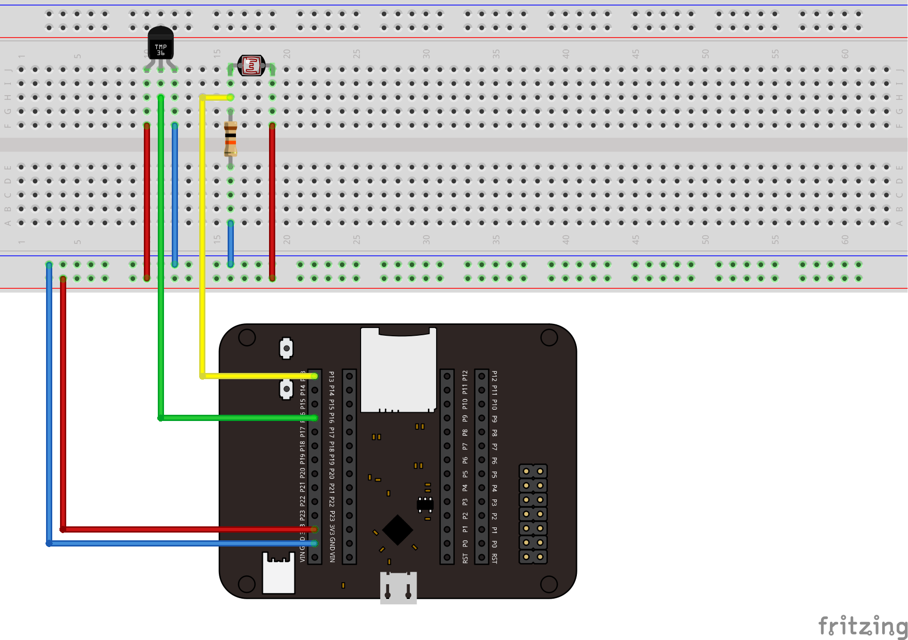
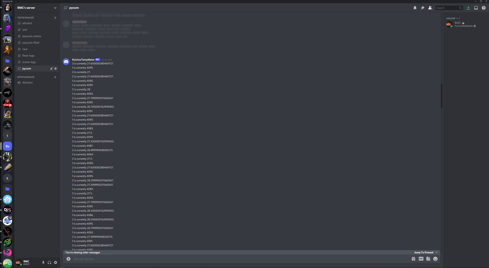

# Tutorial on how to build an temperature/light sensor
#### By Rickard Marjanovic, rm222jx

## Project overview
This project describes how to easily create a sensor that monitors the lights and temperature of your home. Readings will be sent to discord for both temperature and light taking advantage of discords database and chat system, making me able to share statistics between members of my home.
With minimum programming skills and the use of external providers you'll be able to setup a functioning solution.

Following this tutorial will probably take approximately 1-3 hours depending on experience level.

## Objective
I decided to create this sensor since we currently have a summerhouse that I want to monitor whenever we are not present. I would like to see the light levels and temperature to make sure that furniture, plants and other things doesn't take damage due to prolonged unmonitored exposure. We all know that heat and light can damage furniture and other things in a home.

## Material
- LoPy4: Micropython-programmable microcontroller
- Expansion Board: Allows the LoPy4 to connect with pins
- Breadboard: Base for connections
- Jumpwire: Connect different items/pins
- MCP9700 TO-92: Measure temperature (-40°C to 125°C)
- Photo resistor CdS 4-7 kohm: Light dependent resistor (LDR). resistance decreases when light increases.

| Material                                              | Price   | Where to buy                                                                                  |
| ----------------------------------------------------- | ------- | --------------------------------------------------------------------------------------------- |
| LNU – 1DT305 Tillämpad IoT – LoPy4 and sensors bundle | 949 SEK | [Link](https://www.electrokit.com/produkt/lnu-1dt305-tillampad-iot-lopy4-and-sensors-bundle/) |


The LoPy4 has been the base for this project as one of the recommended boards for this course it has a lot of capabilities, especially useful for IoT implementations.
## Computer setup
- Programming language: Python was selected as it’s a very popular language, available to embeded devices through MicroPython. Used [Python (3.9.6)](https://www.python.org/downloads/) with can be installed by following the link, download the installation file and follow the instructions for install.
- IDE: [Visual Studio Code](https://code.visualstudio.com/) was used as I have experience with using this IDE before. I also installed the [pymakr](https://marketplace.visualstudio.com/items?itemName=pycom.Pymakr) extension in order to simplify upload/running of code. Follow the links and click on download and follow the instructions to install.
- Firmware: Select the [firmware updater](https://pycom.io/downloads/) for your computer OS install this, plug in the LoPy4 to the computer via USB and follow the instructions to select the wanted firmware. For my project I selected FW1.20.2.R4.
- Run: In order to run the application simply open VS Code, connect your LoPy4 to the computer via USB, make sure that your latest/current project is selected and press the run button.
- A great option for one that is not interested in coding as much, is to setup your device on the pybytes website. At [Pycom](https://pybytes.pycom.io/) you can sign up, set up a network connection over WiFi, LoRa, Sigfox or LTE, update firmwares and many more things.
## Putting everything together
- ±5% 10kΩ resistor used. In series with the photo resistor to be able to measure the variance of voltage caused by light. If there was no resistor the voltage would be constant.
- Both sensors work with 3,3 volts

## Platform
In order to keep things simple and slim in code I used Pybytes online platform which let me keep all data, fast access and free of charge. The platform enables me to integrate with my LoPy4 device, setup WiFi (LORA or SigFox), update firmware, create dashboards and integrate with other technologies like webhooks (which was used in this project).

## Code
- Wifi setup: [Pycom](https://pybytes.pycom.io/) was used to configure wifi connections and thus no setup of wifi connection was needed in the code.
```python
# Importing nessecary libraries.
import time
from machine import Pin
from machine import ADC

# Initializing object to use with connected sensors
adc = ADC()

# Setting up temp meter with the correct pin
apinTemp = adc.channel(pin='P16')

# Setting up the light meter with the correct pin
LightSensorPin = 'P13'
lightPin = Pin(LightSensorPin, mode=Pin.IN)
apinLight = adc.channel(attn=ADC.ATTN_11DB, pin=LightSensorPin)

# Do until all time
while True:
    # Calculating temp based on volts
    millivolts = apinTemp.voltage()
    celsius = (millivolts - 500.0) / 10.0

    # Sends a signal to Pybytes which will store their database as well as show up in the dashboard
    pybytes.send_signal(2, celsius)
    print("sending: {}".format(celsius))

    # Reads current light value
    val = apinLight()

    # Sends a signal to Pybytes which will store their database as well as show up in the dashboard
    pybytes.send_signal(1, val)
    print("Value", val)

    # Wait 30 minutes
    time.sleep(1800)

```
## Connectivity
- The data is sent every 30 minutes over WiFi.
- The LoPy4 is plugged into an wall outlet with a basic android charger, neither power nor range was a problem for me.
- Pybytes.send_signal is used for transmitting one signal for each type of measurment (temperature, light) over MQTT, which will make the data available at Pycom.
- Pycom in turn sends the data through webhooks to a Discord channel. Please see this guide to be able to mimic this.
## Presenting the data
- By using pycom, I take advantage of their free database which is automatically setup when I use their service. The data is saved for one month and it’s saved as often as it’s sent. In this case every 30 minutes.
- Pycomn is highly customizable, and they offer several different options to cuztomize dashboards, different kinds of graphs, size etc.

- Triggers can be setup, and in this project an webhook integration was setup with Discord, so I don't need to login to Pycom to see the data.


## Finalizing the design
Here is images of the final design of the project. Once you started understand more about the hardware it became much smoother. I think the project went well and it was "pretty" easy to assemble the device and all the wiring and sensors. I stumbled upon one programatically problem changing the base of the light reader from 0-4 k to 0-1 k which caused my readings for the temperature meter show strange readings. You can take this project much further and keep on building on it by e.g. improving handling to Discord. In my case I just send out all values, but one could expand and add another layer by using [Grafana](https://grafana.com/) to only send out messages if a specific treshhold is met.


